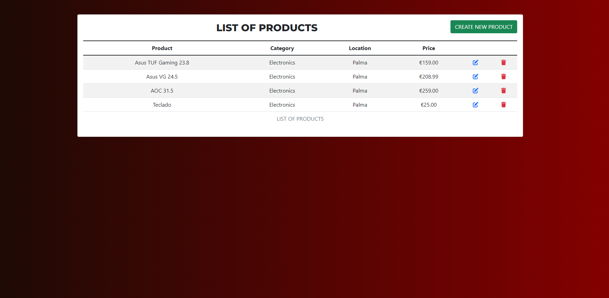
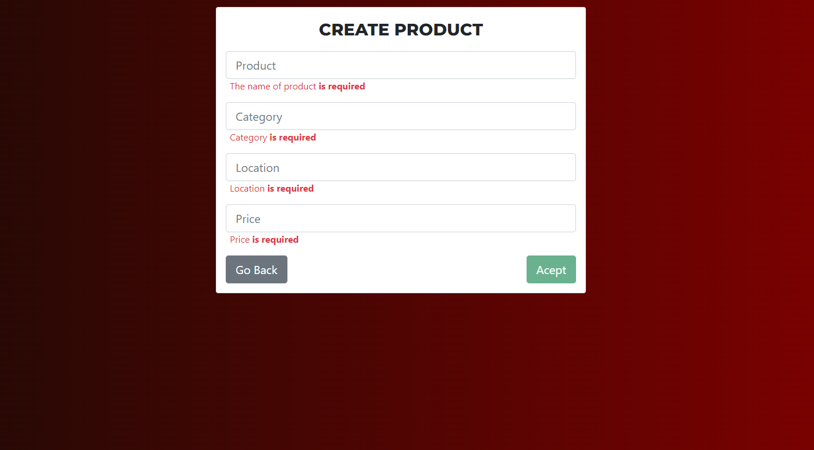

#  MEAN APP CRUD Products

Simple Apps with CRUD made with the MEAN Stack (Mongodb, Express.js, Angular, Node.js )

This project was generated with [Angular CLI](https://github.com/angular/angular-cli) version 13.2.6.


Created with
+ *Javascript.*
+ *TypeScript.* 
+ *Angular.*
+ *bootstrap5.*
+ *Mongodb.*
+ *Express.js.*
+ *Node.js*
+ *Heroku*
+ *Vercel*
+ *Testing : Cypress.io*


## View Online in Vercel Deployinment
=>
+ [Click Here](https://app-mean-crud.vercel.app/).

# Directions for executing the project

# Install Frontend

+ `npm install`.

```
/frontend (main)


`npm install` 

or 

`npm i`

```


# Install Backend

+ `npm install`.

```
/ (main)


`npm install` 

or 

`npm i`

```
# Environments

+ add .env


```
DB_MONGO= <add URI MONGO>

```


+ Finally, run the process with `npm start` in frontend and backend

```
/frontend (main)


npm start

```

# Preview 

# List-Products




# Create-Product




# Edit-Produduct


# Delete-Product


# Deployinment

## View Online - Deploy Backend in Heroku and Frontend in Vercel 


____
+ [Click Here](https://app-mean-crud.vercel.app/).
____


# TESTING WITH CYPRESS.IO

+ Run all tests with 


```
/MEAN (main)


npm test or cypress open

```


